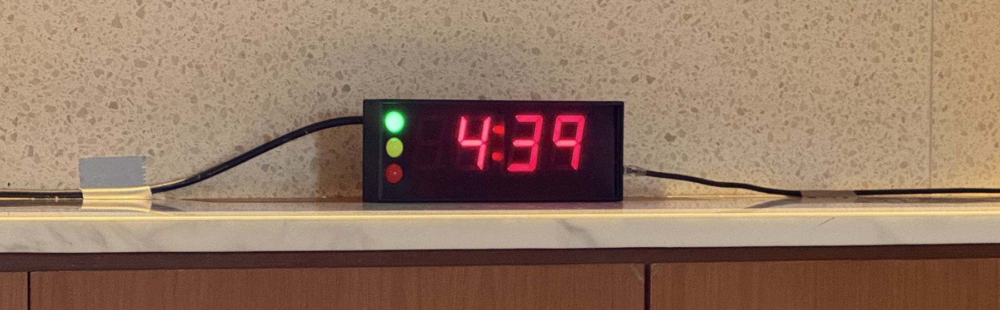
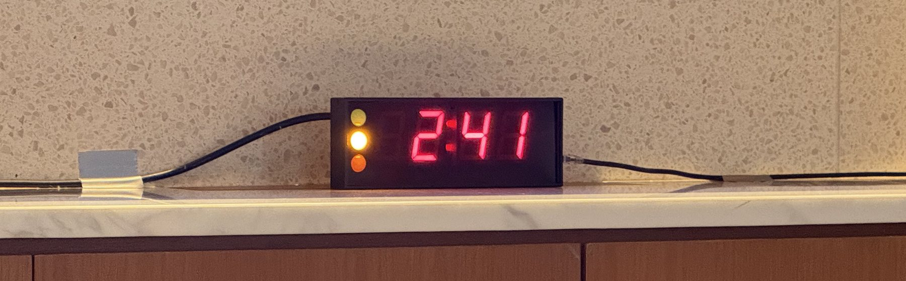

Chairing a session looks simple from the audience. Someone stands up, reads a short introduction, watches the clock, and asks for questions. But a good chair does a lot of quiet work before and during the session, and most of it comes down to one thing: making the presenters comfortable so they can do their best.

I have been on both sides. As a presenter, I get anxious about time. As a chair, I now try to give speakers the things I wish I had when I was nervous at the lectern. Here is what I do, step by step.

## Arrive early and meet your presenters

Get to the room well before the session starts, ideally 15 to 20 minutes early. Find each presenter, introduce yourself, and let them know you are the chair.

A few small questions make a big difference:

- How would you like to be introduced? (Name, title, affiliation, and anything they are proud of.)
- How do you pronounce your name? Say it back to them until you get it right.
- Is there a particular achievement or angle you would like me to mention?

Getting a name right is a sign of respect, and getting it wrong in front of an audience is an easy mistake to avoid.

## Send them to check their slides

Once you have said hello, ask each presenter to see the technical support team and load or check their slides. Animations, fonts, embedded videos, and links often behave differently on the room's computer. It is far better to find a broken slide ten minutes early than during the talk.

While you are there, find out who to call if the technology fails, so you are not searching for help in the middle of a problem.

## Set up the timer

If the room has a timer, decide how you want it to work and tell the support team before the session starts. Many timers use a traffic light system:

- Green: there is plenty of time.
- Yellow: start wrapping up (for example, yellow when 2 minutes are left).
- Red: stop.

Agree on the exact thresholds, for example yellow at two minutes and red at zero, and make sure the presenter can see the timer from where they will stand.

```{=html}
<figure class="tsw">
  <div class="tsw-stage" id="tsw1">
    
    
  </div>
  <div class="tsw-bar">
    <div class="tsw-seg" data-active="green" role="group" aria-label="Switch the timer light">
      <span class="tsw-thumb" aria-hidden="true"></span>
      <button class="tsw-btn is-active" type="button" data-go="green" aria-pressed="true"><span class="tsw-dot tsw-dot--g" aria-hidden="true"></span>Green</button>
      <button class="tsw-btn" type="button" data-go="yellow" aria-pressed="false"><span class="tsw-dot tsw-dot--y" aria-hidden="true"></span>Yellow</button>
    </div>
    <figcaption class="tsw-cap" aria-live="polite">Green: plenty of time</figcaption>
  </div>
</figure>

<style>
.tsw{margin:1.6rem 0;}
.tsw-stage{position:relative;width:100%;aspect-ratio:1800 / 558;border-radius:var(--card-radius);overflow:hidden;background:var(--panel-bg);border:1px solid var(--border);box-shadow:var(--card-shadow);}
.tsw-img{position:absolute;inset:0;width:100%;height:100%;object-fit:cover;}
.tsw-base{z-index:1;}
.tsw-over{z-index:2;opacity:0;transition:opacity .65s var(--ease);will-change:opacity;}
.tsw-over.show{opacity:1;}
.tsw-bar{display:flex;align-items:center;justify-content:space-between;gap:.7rem 1rem;flex-wrap:wrap;margin-top:.75rem;}
.tsw-seg{position:relative;display:inline-flex;padding:4px;background:var(--panel-bg);border:1px solid var(--border);border-radius:999px;}
.tsw-thumb{position:absolute;top:4px;bottom:4px;left:4px;width:calc(50% - 4px);border-radius:999px;background:var(--surface);background:color-mix(in srgb, var(--brand) 16%, var(--bg));box-shadow:0 1px 3px rgba(16,27,53,.14);transform:translateX(0);transition:transform .35s var(--ease);}
.tsw-seg[data-active="yellow"] .tsw-thumb{transform:translateX(100%);}
.tsw-btn{position:relative;z-index:1;flex:1 1 0;min-width:92px;display:inline-flex;align-items:center;justify-content:center;gap:.45rem;padding:.44rem .9rem;border:0;background:transparent;border-radius:999px;font-family:inherit;font-weight:600;font-size:.82rem;line-height:1;color:var(--text-muted);cursor:pointer;-webkit-tap-highlight-color:transparent;transition:color .2s var(--ease);}
.tsw-btn.is-active{color:var(--heading);}
.tsw-btn:focus-visible{outline:2px solid var(--brand);outline-offset:3px;}
.tsw-dot{width:9px;height:9px;border-radius:50%;flex:none;}
.tsw-dot--g{background:#2bb24c;box-shadow:0 0 0 3px rgba(43,178,76,.16);}
.tsw-dot--y{background:#f3a712;box-shadow:0 0 0 3px rgba(243,167,18,.16);}
.tsw-cap{margin:0;font-size:.8rem;color:var(--text-muted);}
@media (hover:hover){.tsw-btn:not(.is-active):hover{color:var(--heading);}}
@media (prefers-reduced-motion:reduce){.tsw-img,.tsw-thumb,.tsw-btn{transition:none;}}
@media (max-width:560px){.tsw-bar{justify-content:center;}.tsw-cap{flex-basis:100%;text-align:center;}}
</style>

<script>
(function(){
  var stage=document.getElementById('tsw1');
  if(!stage)return;
  var fig=stage.closest('.tsw');
  var seg=fig.querySelector('.tsw-seg');
  var btns=fig.querySelectorAll('.tsw-btn');
  var over=stage.querySelector('.tsw-over');
  var cap=fig.querySelector('.tsw-cap');
  var labels={green:'Green: plenty of time',yellow:'Yellow: start wrapping up'};
  function set(state){
    if(seg.getAttribute('data-active')===state)return;
    seg.setAttribute('data-active',state);
    btns.forEach(function(b){var on=b.dataset.go===state;b.classList.toggle('is-active',on);b.setAttribute('aria-pressed',on?'true':'false');});
    over.classList.toggle('show',state==='yellow');
    if(cap)cap.textContent=labels[state];
  }
  btns.forEach(function(b){b.addEventListener('click',function(){set(b.dataset.go);});});
  var x0=null,y0=null;
  stage.addEventListener('touchstart',function(e){var t=e.changedTouches[0];x0=t.clientX;y0=t.clientY;},{passive:true});
  stage.addEventListener('touchend',function(e){if(x0===null)return;var t=e.changedTouches[0];var dx=t.clientX-x0,dy=t.clientY-y0;if(Math.abs(dx)>40&&Math.abs(dx)>Math.abs(dy)){set(dx<0?'yellow':'green');}x0=y0=null;},{passive:true});
})();
</script>
```

## Tell the presenter where the buffer is

This is the part I care about most, because I know how it feels to be anxious about time.

Let the presenter know if there is a little flexibility. For example, if you have room in the schedule, you might tell them that if they run slightly over, you can trim a question or two from the Q&A. Speakers who know there is a small buffer relax, and relaxed speakers give better talks.

The reverse is also worth saying out loud. If someone tends to get carried away, gently let them know in advance that you will keep an eye on the time and may move to questions when the timer turns red. Setting that expectation early means you are not surprising them on stage.

## A template to introduce the presenter

Keep the introduction short. The audience came for the speaker, not for you.

> Good morning, everyone. Our next speaker is [Name], [title] at [affiliation]. [One sentence on why they are well placed to speak on this topic.] Today they will be talking about [title of talk]. Please join me in welcoming [Name].

Read the name slowly and clearly, then sit back and let them take over.

## During the talk

Watch the time so the presenter does not have to. Use the timer or an agreed hand signal. If you promised a buffer, honour it. If the talk is overrunning and there is no room left, be ready to step in politely when the timer turns red.

## A template to thank the speaker and open questions

When the talk ends, thank the presenter and invite questions clearly:

> Thank you, [Name], for that excellent talk. We have a few minutes for questions. If you have one, please raise your hand and wait for the microphone.

If there is a microphone, remind people to wait for it, and repeat or paraphrase each question before the speaker answers. This helps everyone at the back of the room, and it matters even more if the session is being recorded or streamed.

## When nobody asks a question

Silence after a talk is normal and almost always temporary. Give it a few seconds, then start things off yourself. Having a couple of strong questions ready takes the pressure off everyone.

Good fallback questions are open, easy to answer, and invite the speaker to reflect rather than defend:

- What surprised you most in this work?
- If you had more time or resources, what would be your next step?
- What do you see as the main limitation, and how might it be addressed?
- How would this apply in a different setting, for example a lower-resource one?
- What is the single most important takeaway for the people in this room?

Once you ask the first one, others usually follow.

If a questioner starts giving a speech instead of asking a question, you can bring them back gently: "That is a great point. What is your question for the speaker?" Keep things moving so as many people as possible get a turn.

## Close the session

When time is up, thank the speaker again, thank the audience, and hand over cleanly to whatever comes next:

> Thank you again, [Name], and thank you all for your questions. [Any housekeeping, for example: the next session starts at X, or coffee is outside.] Let us give our speakers one more round of applause.

## One last thing

Remember that the focus is on the presenter, not on you. Your job is to make them look good and keep things running smoothly. If you have done the quiet work beforehand, the session almost runs itself. So relax, enjoy it, and you will be fine.
